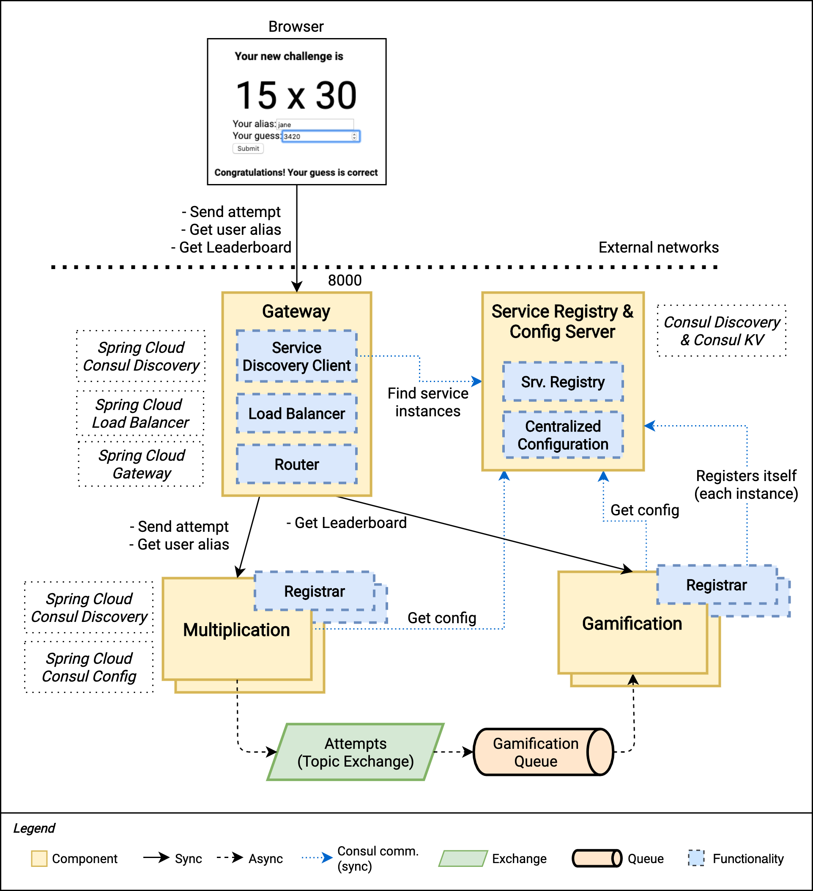

# Introduction
In this book, you build an application where users can exercise their brains by performing mathematical calculations. 
Users will be presented with a new problem every time they access the application. 
They provide theiralias (a short name) and submit answers to the problem. After they submit their input,
the web page will indicate whether their answer is correct.
The web application you build will encourage users to exercise their brains daily.
To begin with, it will present users with two-digit multiplications, one every time they
access the page. They will type their alias (a short name) and their guess for the result of the operation. The idea is that they should use only mental calculations. After they send the data, the web page will indicate if the guess was correct or not.
To keep user motivation as high as possible, you will use some gamification. For each correct guess, the users get points and they will see their score in a ranking so that they can compete with other people.

# business requirements

## USER STORY 1 
As a user of the application, I want to be presented with a
random multiplication problem so that I can solve it using mental calculation and exercise my brain.
## User Story 2 
As a user of the application, I want to be able to access my
previous attempts so that I can track my progress and determine if my brain skills are improving over time.
### Tasks:
* Store all the user attempts and have a way to query them per user.
* Expose a new REST endpoint to get the latest attempts for a
given user.
* Create a new service (business logic) to retrieve those attempts.
* Show the attempts’ history to the users on the web page after they
send a new one.
## User Story 3  
As a user of the application, I want to feel motivated to engage in challenges daily, ensuring I don’t abandon the application after a while. 
This will enable me to exercise my brain consistently and experience continual improvement.

* points: every time you perform an action and do well, you get some points
* Leaderboards: make the points visible to everybody, so they motivate players by activating feelings of competition
* badges: are virtual symbols of achieving status.You’ll also create some basic badges: Bronze (10 correct attempts), Silver (25
correct attempts), and Gold (50 correct attempts)
** The Silver badge. Won if the score exceeds 150.
** The Gold badge. Won if the score exceeds 400.
** The Lucky Number badge. Won if any of the factors of the
attempt is 42.
Because the first correct attempt deserves a nice feedback message, you’ll also introduce a First Correct! badge. 
Also, to introduce a surprise element, you’ll have a badge that users can win only if they solve a multiplication where the number 42 is one of the factors

# Architecture  

As shown in the diagram, you’ll create an attempted exchange, of type Topic. In an
event-driven architecture like this one, this gives you the flexibility to send the events
with certain routing keys and allow consumers to subscribe to all of them or set up their
own filters in their queues.
Conceptually, the Multiplication microservice owns the attempted exchange. It’ll
use it to publish events that are related to attempts coming from the users. In principle,
it’ll publish both correct and wrong items, since it doesn’t know anything about the
consumers’ logic. On the other hand, the Gamification microservice declares a queue
with a binding key that suits its requirements. In this case, this routing key is used as a
filter to receive only correct attempts. As you see in Figure 7-12, you can have multiple
instances of the Gamification microservice consuming from the same queue. In this
case, the broker will balance the load between all instances.

## Modeling the Domain

### Multiplication microservice
This first web application takes care of generating multiplication challenges and
verifying the subsequent attempts from the users. Let’s define these three business
entities.
* Challenge: Contains the two factors of a multiplication challenge.
* User: Identifies the person who will try to solve a Challenge.
* Challenge Attempt: Represents the attempt from a User to solve the operation from a Challenge.
* 
#### Designing the APIs
You can use the requirements to design the functionalities you need to expose in the
REST API.
* An interface to get a random, medium complexity multiplication
* An endpoint to send a guess for a given multiplication from a given
user’s alias

### Gamification microservice
* You create a scorecard object, which holds the amount of score that a user obtains for a given challenge attempt.
* Similarly, you have a badge card object, representing a specific type of badge that has been won at a given time by a user. It doesn’t
need to be tied to a score card since you may win a badge when you surpass a given score threshold.
* To model the leaderboard, you create a leaderboard position. You’ll display an ordered list of these domain objects to show the ranking to the users.

#### Designing the APIs
You can divide the business logic in this new Gamification microservice into two.
* The game logic, responsible for processing the attempt and
generating the resulting score and badges
* The leaderboard logic, which aggregates data and builds the ranking
based on score

# UI
* A new API client to retrieve the leaderboard data from the
Gamification microservice
* An additional React component to render the leaderboar
* You’ll also add a new method to the existing API client to retrieve a list of users based
on their IDs.

## End points
* GET /challenges/random will return a randomly generated
challenge.
* POST /attempts/ will be the endpoint to send an attempt to solve a
challenge.

# Requirements
* Java (we use Java 17)
* Spring boot 3,Spring 6
* Maven 3

# Run
docker run -d --hostname multiplication-rabbit --name multiplication-rabbit -p 5672:5672  -p 15672:15672  rabbitmq:3-management
guest/guest
cd .\multiplication\     
./mvnw spring-boot:run

cd .\gamification\
./mvnw spring-boot:run

cd .\frontend\
npm install
npm start

# URLS
Backend
DB test
http://localhost:8080/h2-console

Fronend
http://localhost:3000/
# Testing
 1..10 | % {http --ignore-stdin POST :8080/attempts factorA=15 factorB=20 userAlias=test1 guess=300}      
 1..10 | % {http --ignore-stdin POST :8080/attempts factorA=15 factorB=20 userAlias=test-g-down guess=300}